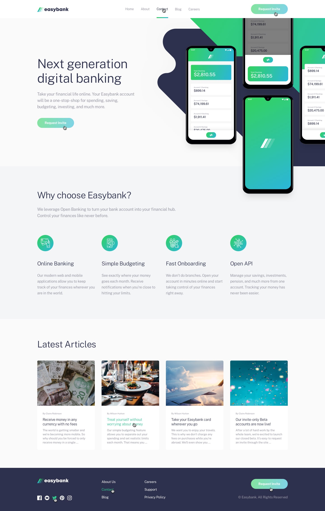

# Frontend Mentor - Easybank landing page
   	

# Overview 

users should be able to:

- View the optimal layout for the site depending on their device's screen size
- See hover states for all interactive elements on the page

# Screenshot
## Preview

## active-states
